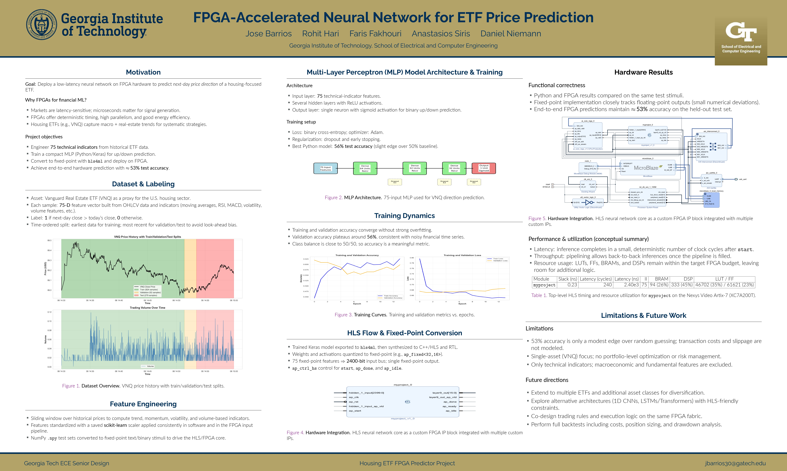

# Housing ETF MLP Predictor

Machine learning model that predicts daily movements of housing ETFs using technical indicators.


## Pre-Trained Model

**VNQ Model (Vanguard Real Estate ETF):**
- Accuracy: 54% on real data (2,513 trading days)
- Features: 75 technical indicators
- Files: `mlp_vnq.h5`, `scaler_vnq.pkl`

## Quick Start

```bash
# Install dependencies
pip install -r requirements.txt

# Use pre-trained VNQ model
python use_vnq_model.py

# Train on different ETF
python mlp_housing_etf_predictor.py
```

## Available ETFs

Change `ticker` in `mlp_housing_etf_predictor.py` to train on:
- **VNQ** - Vanguard Real Estate (already trained)
- **XHB** - Homebuilders
- **REZ** - Residential Real Estate
- **XLRE** - Real Estate Select Sector
- **IYR** - iShares Real Estate

## Model Architecture

```
Input: 75 features
├─ Layer 1: 64 neurons (ReLU + Dropout 0.3)
├─ Layer 2: 32 neurons (ReLU + Dropout 0.2)
├─ Layer 3: 16 neurons (ReLU + Dropout 0.2)
└─ Output: 1 neuron (Sigmoid)
```

## Features (75 total)

- **Trend**: SMA, EMA (multiple periods), MACD, ADX
- **Momentum**: RSI, Stochastic, CCI, ROC
- **Volatility**: ATR, Bollinger Bands
- **Volume**: OBV, CMF, MFI
- **Lagged**: 10-day price/return/volume history

## Usage

```python
from tensorflow.keras.models import load_model
import joblib

# Load model
model = load_model('mlp_vnq.h5')
scaler = joblib.load('scaler_vnq.pkl')

# Predict (X_new must have 75 features)
X_scaled = scaler.transform(X_new)
prediction = model.predict(X_scaled)
# > 0.5 = BUY, < 0.5 = SELL
```

## Files

**Core:**
- `mlp_housing_etf_predictor.py` - Train on housing ETFs
- `mlp_snp500_predictor.py` - Train on S&P 500
- `use_vnq_model.py` - Use pre-trained model
- `predict_example.py` - Prediction examples

**Model Files:**
- `mlp_vnq.h5` - Trained VNQ model
- `scaler_vnq.pkl` - Feature scaler
- `feature_names_vnq.txt` - Feature list

**Visualizations:**
- `training_history_vnq.png` - Learning curves
- `confusion_matrix_vnq.png` - Performance matrix

## Performance

54% accuracy means out of 100 trades, you win 54 and lose 46. With proper risk management, this is profitable.

```
Random guess: 50%
Your model:   54%
Edge:         +8% win rate
```

## Disclaimer

Educational use only. Not financial advice. Past performance doesn't guarantee future results. Use stop losses and proper position sizing.
